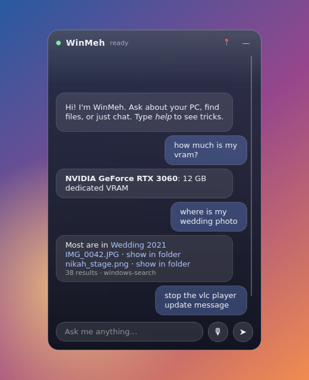
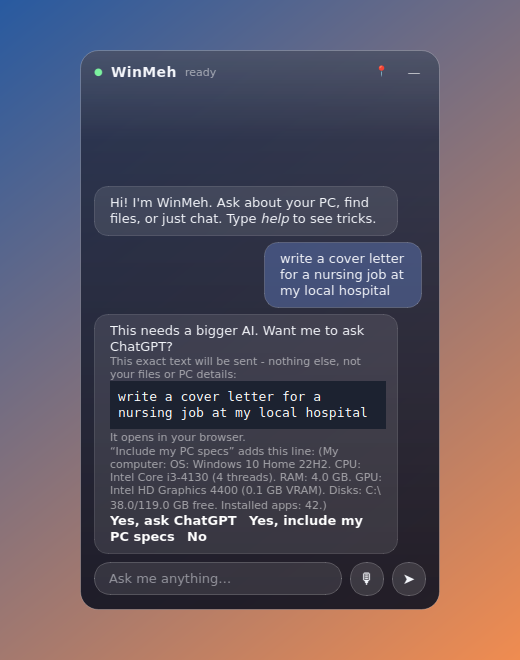
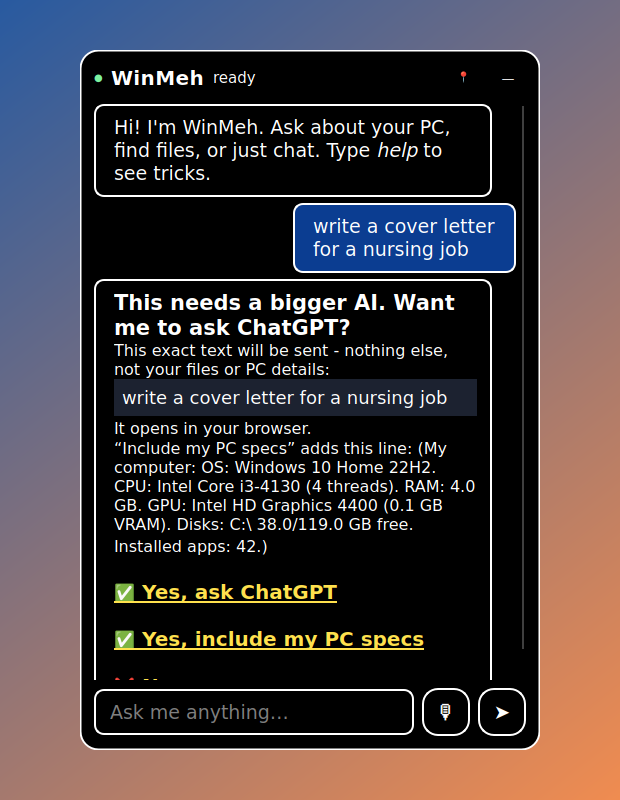

# WinMeh

A small, fast, local-first assistant for Windows 10/11 and Linux. It's built to turn an old PC into a friendly helper that a child, an older person or someone with a disability can just talk or type to.

It sits on your desktop as a draggable glass widget. On install it **indexes** the machine: specs, files, apps, games and storage. That's indexing, not model training. Everyday chores are handled locally and instantly. When a question is too big for the small local model, WinMeh **asks first** and then hands it to ChatGPT, Claude or DeepSeek, which you already use.

Nothing leaves your machine unless you say yes. The only exceptions are the optional Steam requirement lookups and the web searches you ask for.

▶️ **[Watch the 80-second demo](docs/demo.mp4)**. It shows the real WinMeh UI and logic, rendered offscreen with a simulated old PC. Regenerate it with `python scripts/make_demo_video.py`.

  
<sub>This screenshot was rendered offscreen without the native blur. On Windows 10/11 the panel uses the system acrylic blur, so your wallpaper shows through.</sub>

## What it does

| You say | What happens | Speed |
|---|---|---|
| "how much is my **vram**?" | It reads VRAM from `nvidia-smi` or the 64-bit registry value (`HardwareInformation.qwMemorySize`). WMI's `AdapterRAM` caps at 4 GB, so it isn't used. | instant (no AI) |
| "wher is my **wedding photo**" | It searches the Windows Search index (file names, folder names, tags, titles), then falls back to WinMeh's own file index. It expands synonyms (wedding → marriage, bride, nikah, shaadi, biye, holud, reception…), groups results by folder, and gives you *open* and *show in folder* links. | instant |
| "how to **clear the cache**" | It scans user temp, Windows temp, the thumbnail cache, Chrome, Edge, Brave and Firefox caches and the DNS cache, then shows the sizes. **Nothing is deleted until you confirm.** Only cache *contents* are removed, and files that are in use get skipped. | ~1 s scan |
| "get me the **games** I can run" | It finds installed games from Steam, Epic, GOG, Ubisoft and Xbox, rates your PC's gaming tier, and checks each Steam game's published minimum RAM and VRAM. | instant + ~1 s online |
| "can I run **Elden Ring**?" | It looks up the game's Steam minimum requirements and compares them with your RAM and VRAM. | ~1 s online |
| "stop the **VLC** update message" | It sets `qt-updates-notif=0` (and `qt-privacy-ask=0`) in `%APPDATA%\vlc\vlcrc` and keeps a backup of the old file. | instant |
| "check my **drivers**" | It lists devices with problems (Device Manager error codes), shows how old the graphics driver is with a link to the maker's own page, and asks Windows Update for driver updates. It installs them only after you confirm, behind a normal Windows admin prompt. On Linux it uses `ubuntu-drivers` and `fwupd`. **It never uses third-party "driver updater" sites.** | ~5–60 s |
| "**install** vlc", "download chrome" | It looks the app up in **winget** (Windows) or **flatpak / apt / dnf / pacman** (Linux), shows you what it found and installs after you confirm. Popular apps resolve instantly, and if the match is ambiguous you pick from a list. It never downloads from random websites. | instant + install time |
| "**google** best budget laptop", "search youtube for lofi", "**go to** github.com", "open youtube" | Opens the search or site in your default browser. | instant |
| "open spotify", "what are my specs", "how much space is left", "remember that…", "rescan my pc" | built-in commands | instant |
| "what is 15% of 80", "12*7" | A safe built-in calculator (small LLMs get arithmetic wrong). | instant |
| anything else | A ~0.2 ms classifier decides **who should handle it** (see below): the local LLM, a web search, or a bigger online AI. The online AI is only used after you say yes. | first token in about 0.1–0.5 s on CPU |

### Who should handle this? (local, web or a bigger AI)
When none of the built-in skills match, a tiny classifier sorts the question into one of three buckets:

| Bucket | Example | What WinMeh does |
|---|---|---|
| `LOCAL_CHAT` | "tell me a joke", "how do I zoom in" | The local 0.5B model answers. |
| `WEB_SEARCH` | "bitcoin price today", "who won last night" | It opens a Google search. Above 80% confidence it does this straight away; between 50% and 80% it asks first. |
| `ONLINE_LLM` | "write a cover letter…", a pasted stack trace, "compare X vs Y in detail" | **It always asks first:** *"This needs a bigger AI. Want me to ask ChatGPT?"* |

- **How it works:** character 2–4-gram TF-IDF plus hand-made features (length; code signals such as code fences, `def`, `class`, stack traces and `Error:`; task verbs such as write, fix, debug, refactor, compare, summarize, translate and "explain why"; recency words such as latest, today, news, price, score and release; math), fed into a softmax logistic regression.
- **Size and speed:** it's trained and run with plain **numpy**. The weights are a 185 KB JSON file (`winmeh/core/router_model.json`), and a decision takes about 0.2 ms. It adds no dependencies.
- **Thresholds:** above 0.8 it acts, between 0.5 and 0.8 it asks you, and below 0.5 (or when the top class is LOCAL_CHAT) the local model answers.
- **Accuracy:** 94% on a **hand-written held-out set** of 150 queries (`data/router_eval.tsv`), which is checked in CI. The training data (`data/router/*.txt`, about 650 per class) comes from `scripts/make_router_data.py`. Retrain with `python scripts/train_classifier.py`.
- **It adapts to you:** every Yes or No you give is logged locally (`router_feedback.jsonl` in the data folder). Say *"learn from my choices"*, or use the tray item, and it retrains in a couple of seconds on the base data plus your choices, then keeps using that personal model. Nothing about this leaves the PC.
- **Safety net:** if a local answer looks weak (very short, or "I'm not sure"), WinMeh offers the bigger AI afterwards. It still asks first.

### Handing off to an online AI: always with permission
- **The prompt shows exactly what will be sent.** It displays the text in a box. **Your PC details are never attached** unless you press *"Yes, include my PC specs"*, and the prompt shows the exact line that button would add.
- **Where it goes:**

  | Service | How |
  |---|---|
  | ChatGPT | opens `https://chatgpt.com/?q=…` |
  | Claude | opens `https://claude.ai/new?q=…` |
  | DeepSeek, or very long text | copies the text to the clipboard, opens the site, and tells you to press Ctrl+V |
  | Claude Code (if the `claude` command is installed) | asks a **second** time and names the working folder, because it can change files. Then it opens a terminal running `claude "<your question>"`. The question is passed through an environment variable, so quotes and `&` in it can't run extra commands. |

- **Choosing a service:** *Auto* prefers an installed Claude or ChatGPT desktop app, otherwise ChatGPT on the web. Change it with *"set my ai to deepseek"*, *"use claude for big questions"*, or the tray's *Bigger AI* menu. *"ask chatgpt …"* goes to that service directly, but still asks first.
- **What it doesn't do:** no browser automation (no Playwright or Selenium) and no API keys. It only opens normal links in your own browser.

### Why it's fast
1. **No AI for machine questions.** A regex intent router (under 1 ms) sends commands straight to native code. The LLM only handles open-ended chat.
2. **Everything is pre-loaded.** The machine profile is cached, the file index is built in the background, and the speech and language models load and warm up while the widget is already on screen.
3. **Small models.**
   - **LLM:** Qwen2.5-0.5B-Instruct Q4_K_M (~400 MB), served by llama.cpp's `llama-server`. GPU offload is on by default through the Vulkan build. You can switch to Qwen2.5-1.5B with `--model 1.5b`, and any Ollama or LM Studio model is detected automatically.
   - **Speech-to-text:** faster-whisper `tiny.en` with int8 on CPU (~75 MB), greedy decoding, and an energy-based end-of-speech detector that stops 0.7 s after you stop talking.
   - **Text-to-speech:** the built-in Windows SAPI voices. There's nothing to download, and a new reply interrupts the old one.

## Install

### Windows 10 / 11: one click
Download **`WinMeh-Setup.exe`** from the [Releases page](https://github.com/0xAshraFF/WinMeh/releases) and run it. The installer:
- doesn't ask for admin rights,
- needs no Python, Ollama or downloads afterwards, because the chat model (Qwen2.5-0.5B), the llama.cpp engine and the voice model are all inside it,
- starts WinMeh when you sign in (you can untick this).

### Linux (x86-64, glibc 2.35+ e.g. Ubuntu 22.04+, Fedora 36+, Debian 12+)
```bash
curl -fsSL https://raw.githubusercontent.com/0xAshraFF/WinMeh/main/installer/install.sh | bash
```
Or download `WinMeh-linux-x64.tar.gz` from Releases, extract it and run `./install.sh`. It needs no root, adds a menu entry and autostart, and bundles the same models. Remove it with `./install.sh --uninstall`.

Linux has no universal global-hotkey API (Wayland forbids it), so add two shortcuts in your desktop's keyboard settings: `winmeh --talk` and `winmeh --toggle`.

### From source (any OS, for development)
```bash
git clone https://github.com/0xAshraFF/WinMeh && cd WinMeh
python -m pip install -r requirements.txt
python -m winmeh            # on first start it downloads the chat model (~450 MB) by itself
```
Already running **Ollama** with a model pulled? WinMeh uses it automatically.

### Building the installers
`python scripts/build.py --with-models` produces `dist/WinMeh/` with the models bundled. CI then wraps it with Inno Setup (`installer/winmeh.iss`) or as a tarball (`installer/install.sh`). Pushing a `v*` tag publishes both to GitHub Releases.

### Windows 7 / 8
Windows 7 and 8 aren't supported. Qt 6, Python 3.9+, the speech engine and current llama.cpp all need Windows 10. A Win7 "lite" build (Python 3.8 + Qt 5, no voice) is possible but not done yet. Contributions are welcome.

## Using it
- **Drag** the widget by its header. It snaps to screen edges and remembers where you left it.
- **📍 / 📌** switches between living on the desktop layer (like a widget) and staying always on top.
- **Ctrl+Alt+Space** (Windows) or your `winmeh --talk` shortcut (Linux) starts talking, and pressing it again stops early. Recording also ends by itself when you stop speaking.
- **Ctrl+Alt+W** shows or hides the widget. **Esc** hides it.
- **Tray icon:** speak replies on/off, start with Windows, re-learn this PC, accessibility mode, kid-safe mode, which bigger AI to use, learn from my choices, quit.
- **Accessibility mode** (*"accessibility on"* or the tray). Turning it on gives:
  - large text (19–21 px) with white-on-black high contrast and yellow underlined links,
  - bigger buttons with a visible focus ring,
  - slower speech,
  - simple yes/no questions with one big button per line, labelled with what happens (for example "✅ Yes, ask ChatGPT").
- **Kid-safe mode** (*"kid safe on"* or the tray). It asks you to choose a **parent PIN**, stored only as a salted PBKDF2 hash. Then:
  - Google searches use **SafeSearch**, and YouTube searches go through Google SafeSearch.
  - **Installing apps or drivers, asking an online AI, and opening an unknown link all need the PIN.**
  - Turning kid-safe mode off needs the PIN too.
- **Unknown links:** before opening any link that isn't on the known-sites list (Google, YouTube, the GPU makers, ChatGPT, Claude and so on), WinMeh warns you and waits for a yes.
- **Every action that changes something** (installing, clearing caches, driver updates, hand-offs, unknown links) waits for your confirmation.
- **Headless:** `winmeh --ask "how much vram do I have"`, `winmeh --selftest`. With the widget running, `winmeh --talk`, `--toggle` and `--quit` control it.

Settings are in `%LOCALAPPDATA%\WinMeh\settings.json`. The data stored next to it is `profile.json` (machine profile), `files.db` (file-name index) and `memory.json` (things you asked it to remember).

## Project layout
```
winmeh/
  core/router.py      instant intent rules
  core/classifier.py  LOCAL_CHAT / WEB_SEARCH / ONLINE_LLM classifier (numpy), feedback + retraining
  core/handoff.py     online-AI detection, exact-text preview, ?q= links / clipboard / Claude Code
  core/calc.py        safe arithmetic
  core/assistant.py   skills, permission flow, LLM fallback
  core/llm.py         OpenAI-compatible streaming client, manages llama-server
  core/bootstrap.py   finds bundled models, or downloads them on first run
  system/             profile, gpu, files, games, cache, apps, drivers, packages, web
  voice/              stt (faster-whisper), tts (SAPI), hotkey (RegisterHotKey)
  ui/                 glass widget + native acrylic blur
scripts/build.py      PyInstaller build (+ --with-models)
scripts/make_router_data.py, train_classifier.py   classifier data + training
data/router/          classifier training examples; data/router_eval.tsv = hand-written held-out set
installer/            Inno Setup script (Windows), install.sh (Linux)
tests/                pytest; CI runs them on Windows and Linux, plus a real-Windows self-test and an exe build
```

## Honest limitations
- **Photo search matches names, folders and tags, not image content.** If your wedding photos are all called `IMG_1234.jpg` in a folder named `Camera`, it won't find them yet. Semantic image search with a small CLIP model is the top roadmap item.
- **"Can I run it" only compares RAM and VRAM** against Steam's published minimums. It shows the required GPU model but doesn't benchmark it against yours. Non-Steam games are listed without a check.
- **The 0.5B model is fast but basic.** It's fine for short chat, weak for reasoning. Use `--model 1.5b`, or point `llm_url` at a bigger model.
- **"Live on the desktop" uses the bottom window layer.** Pressing **Win+D** still hides it. Use the 📌 mode or Ctrl+Alt+W to bring it back.
- **Voice is push-to-talk (hotkey or mic button).** There's no always-on wake word yet.
- **Driver updates come from Windows Update only.** If the maker hasn't published a driver there, WinMeh links to the maker's site instead of installing it itself.
- **The Linux build is x86-64 only for now**, and it was tested on GitHub's Ubuntu runners. Other distros should work but haven't been verified.
- **The `?q=` links aren't official APIs.** `chatgpt.com/?q=` and `claude.ai/new?q=` are URL behaviours, not documented integrations, and either company could change or remove them. If one stops working, choose DeepSeek or another clipboard-based option in settings (the clipboard path always works), and please open an issue. You also need to be signed in to that service in your browser, and whether the question is sent automatically or just filled in depends on the site.
- **The classifier can be wrong.** About 6% of the held-out set is misrouted. Typical misses are questions with no recency words that still need the web ("is gmail down") and planning requests that sound like chat. Because of the 0.5–0.8 "ask" band, the No button and the safety net, a mistake costs you one click, never a silent send. The training data comes partly from templates, so accuracy on your own phrasing may be lower until it learns from your choices.
- **Desktop-app detection only picks the default.** If the ChatGPT or Claude desktop app is installed, WinMeh prefers that service, but it still opens the web version, because the desktop apps don't accept a prefilled question.
- **Kid-safe mode isn't a full parental-control system.** SafeSearch only applies to searches WinMeh starts. It doesn't filter the browser itself and can't force YouTube Restricted Mode. Use your operating system's family controls as well.
- **Accessibility mode hasn't been tested with screen readers** such as NVDA, Narrator or Orca, or by people with disabilities yet. Feedback is very welcome.
- Development and CI happen on GitHub's Windows runners. Latency numbers on your own hardware will vary, so please share yours.

## Roadmap
- Semantic photo search (CLIP / SigLIP, on-device)
- Optional wake word ("hey WinMeh", openWakeWord)
- GPU benchmark table for "can I run it"
- More fixes like the VLC one (Adobe/Java updaters, startup apps, notifications)

## Contributing
PRs are welcome. Adding a skill takes three steps: add a rule in `core/router.py`, add a `do_<intent>` method in `core/assistant.py`, and add a test. Run `python -m pytest`.

## License
MIT
